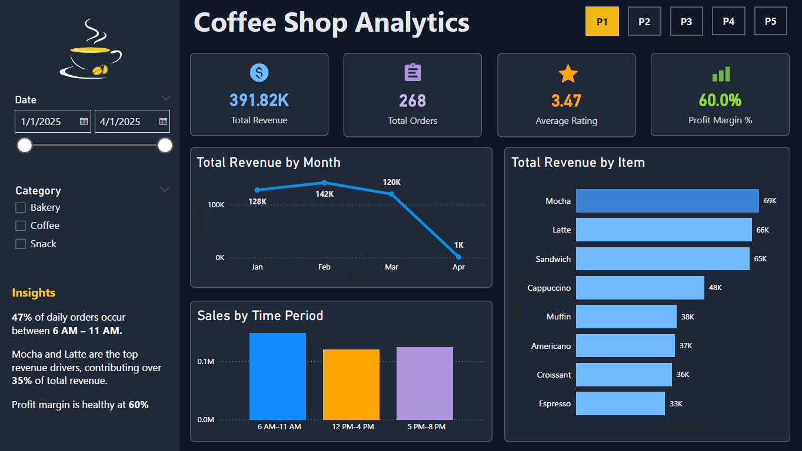
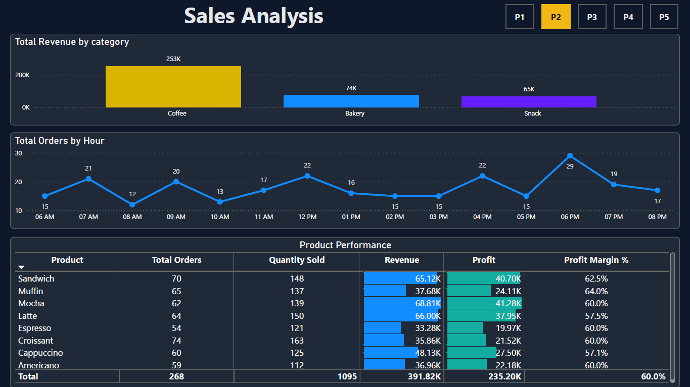
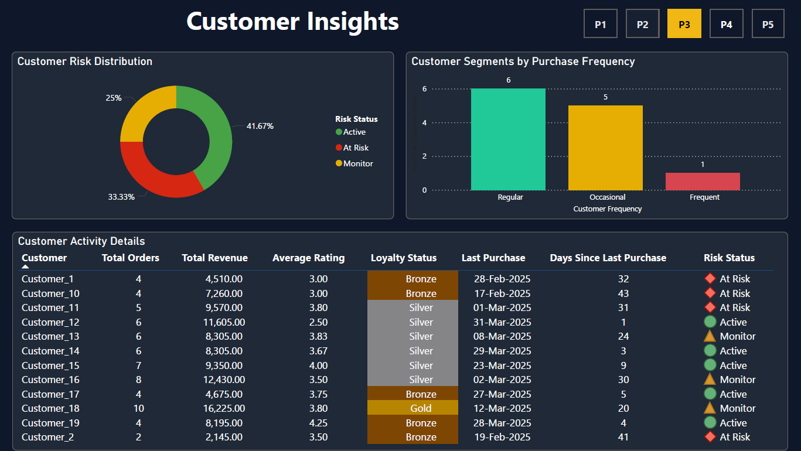
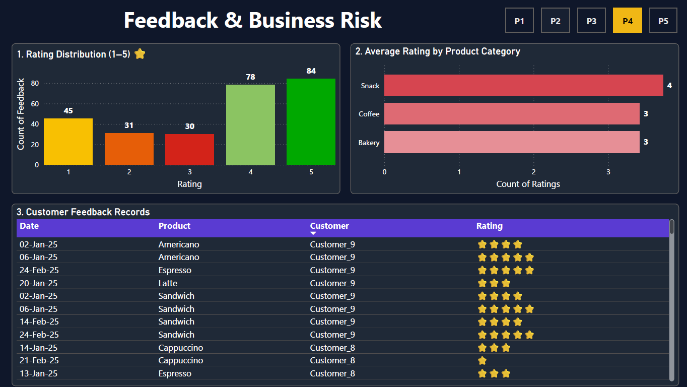
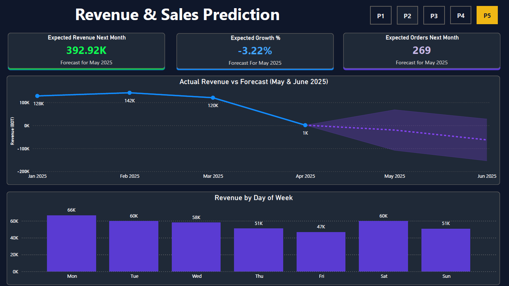

# ☕ Coffee Shop Analytics — Power BI Dashboard

Built a Coffee Shop Analytics Dashboard using MySQL and Power BI.

Designed and populated SQL tables in MySQL, then transformed and analyzed the data in Power BI to create a 5-page interactive dashboard covering sales performance, customer insights, product profitability, feedback analysis, and revenue forecasting.

---

## 📊 Dashboard Pages

| Page | Title | Key Visuals |
|------|-------|-------------|
| P1 | Coffee Shop Analytics | KPI cards, revenue by month, revenue by item, sales by time period |
| P2 | Sales Analysis | Revenue by category, orders by hour, product performance table |
| P3 | Customer Insights | Risk distribution, loyalty segments, customer activity |
| P4 | Feedback & Business Risk | Rating distribution, category ratings, feedback records |
| P5 | Revenue & Sales Prediction | Forecast KPIs, actual vs forecast chart, revenue by weekday |

---

## 🔍 Key Insights

- **47%** of daily orders occur between **6 AM – 11 AM**
- **Mocha** and **Latte** are top revenue drivers, contributing over **35%** of total revenue
- Overall **Profit Margin** is healthy at **60%**
- **Coffee** category dominates with **253K** revenue out of 391.82K total
- **33%** of customers are classified as "At Risk" — retention action needed
- Revenue forecast for May 2025 shows a **−3.22% growth** trend — an early warning signal

---

## 🛠️ Tools & Techniques Used

- **MySQL & MySQL Workbench** — Database design, table creation, SQL queries for data extraction
- **Star Schema Modeling** — Fact and dimension tables designed for analytical querying
- **Power BI Desktop** — Data import from MySQL, report design, DAX measures
- **DAX** — KPI calculations, profit margin, risk classification, forecast measures
- **Data Visualization** — Bar charts, line charts, donut chart, matrix table, KPI cards
- **Business Analysis** — Customer segmentation, revenue forecasting, feedback analysis
  
---

## 📸 Screenshots

### P1 — Coffee Shop Analytics Overview

### P2 — Sales Analysis

### P3 — Customer Insights

### P4 — Feedback & Business Risk

### P5 — Revenue & Sales Prediction

---

## 📁 Files

| File | Description |
|------|-------------|
| `Coffee_Shop_Analytics.pbix` | Main Power BI report file |
| `sql/Coffee_Shop_Analytics_Tables.sql` | MySQL table creation scripts and data extraction queries |
| `images/` | Dashboard page screenshots |

---

## 👩‍💻 Author

**Nusrat Mili**  
MSc in Data Science | Power BI | Python | SQL  
[LinkedIn](https://www.linkedin.com/in/nusrat-mili-3a21a9162/) | 
[GitHub](https://github.com/NusraatMili)
