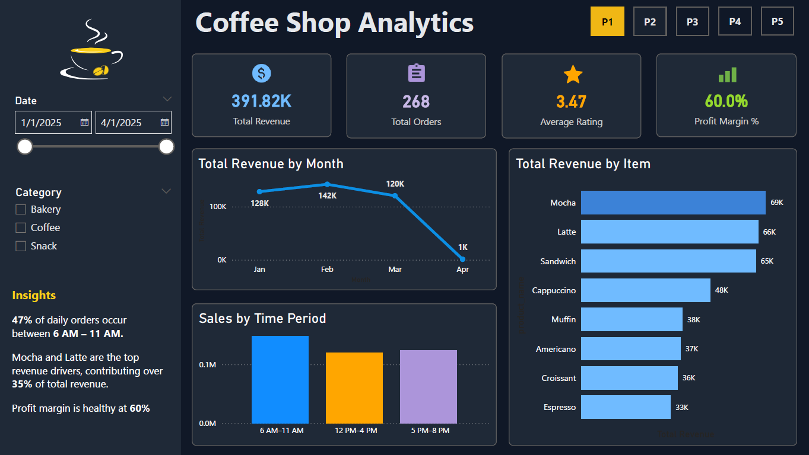
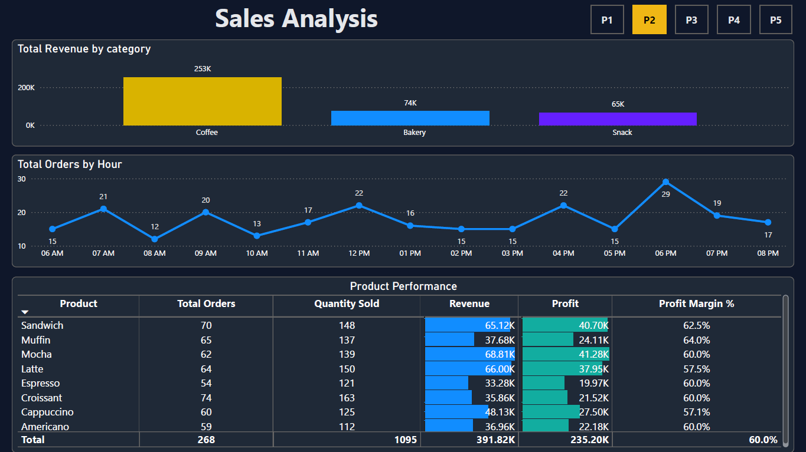
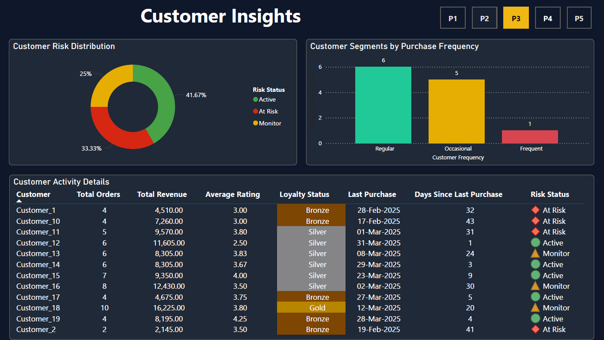
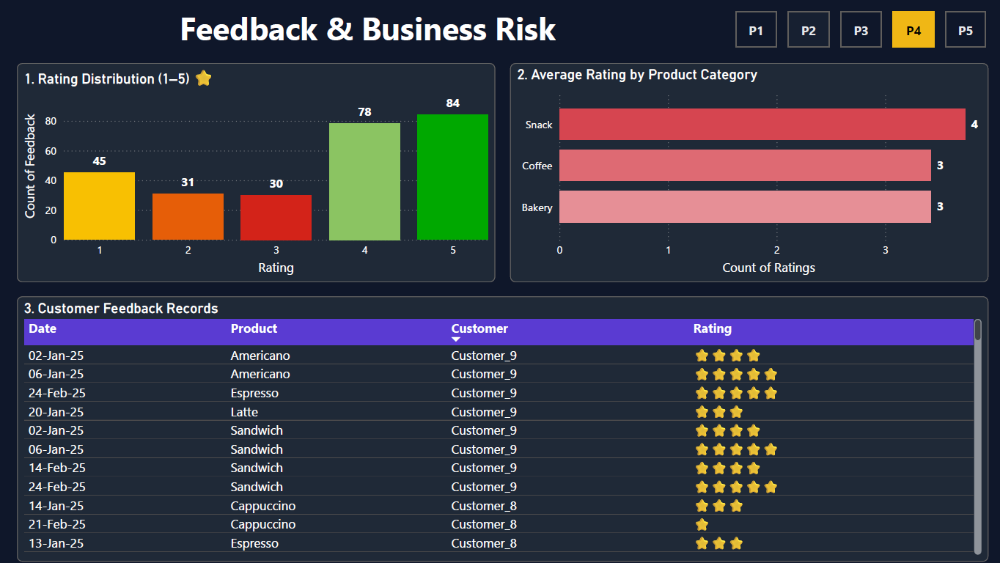
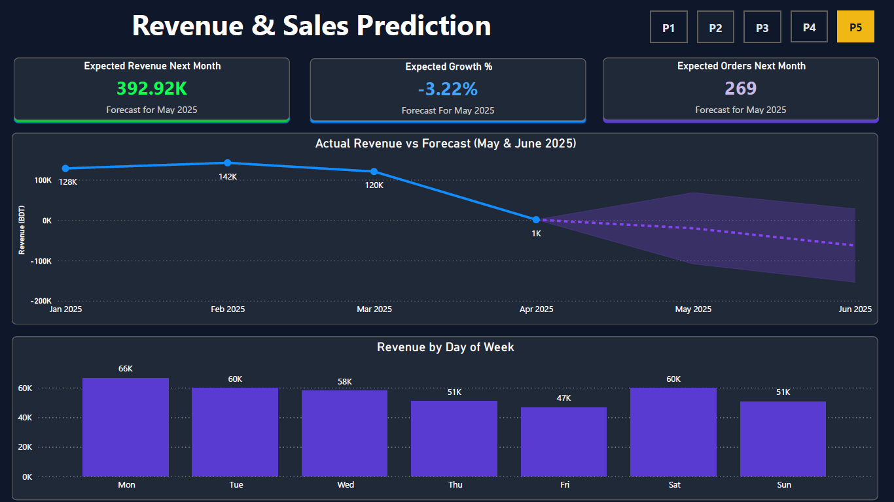

# ☕ Coffee Shop Analytics - Power BI Dashboard

An end-to-end data analytics project using MySQL and Power BI to turn coffee shop transaction data into clear business insights about sales, customers, products, feedback, profitability, and revenue trends.

---

## 💡 Why I Built This Project

Imagine running a coffee shop with hundreds of customer transactions every day. You know what customers buy, when they visit, how much they spend, and how they rate their experience.

But raw transaction records don't easily answer important business questions:

- Which products generate the most revenue?
- When are customers most active?
- Which customers may need more attention?
- How satisfied are customers?
- What does the revenue trend suggest about future sales?

**I built this project to turn that raw data into clear, easy-to-understand business information.**

Using **MySQL** and **Power BI**, I created an interactive dashboard that brings sales, products, customers, feedback, profitability, and revenue trends together in one place.

The goal was not simply to create charts, but to show how **data can be transformed into insights that support business decisions.**

## 🔄 How It Works

The project follows a simple process:

**Raw Business Data → Data Preparation → Analysis → Interactive Dashboard → Business Insights**

- **MySQL** - Organized the business data and created the required tables and queries.
- **Power BI** - Connected, transformed, modeled, and visualized the data.
- **DAX** - Created calculations for important business metrics.
- **Dashboard** - Presented the results in a simple and interactive format.
- **Analysis** - Identified patterns and insights that could be useful for decision-making.

## 👥 Who Could Benefit?

This type of dashboard could help:

- **Business Owners** - quickly understand overall sales and business performance.
- **Operations Managers** - identify sales patterns and product performance.
- **Marketing Teams** - understand customer behavior and engagement.
- **Decision Makers** - use data to support planning and business decisions.

Although this project focuses on a coffee shop, the same approach can be applied to **cafés, restaurants, food retailers, and other customer-focused businesses.**

## 📊 Dashboard Pages

| Page | Focus | Business Question |
|------|-------|-------------|
| P1-Overview | Overall business performance | How is the business performing? |
| P2-Sales Analysis | Sales and product performance | What are customers buying and when? |
| P3-Customer Insights | Customer activity and risk | Which customers may need attention? |
| P4- Feedback & Business Risk | Ratings and feedback | How are customers experiencing the products? |
| P5-Revenue & Sales Prediction | Revenue trends and forecast | What does the recent revenue trend suggest? |

---

## 🔍 Key Business Insights

The analysis of the dataset produced several notable findings:

- **47%** of daily orders occur between **6 AM and 11 AM**, highlighting the importance of the morning period.
- **Mocha and Latte** contribute more than **35%** of total revenue, making them major revenue-generating products.
- The calculated overall **profit margin is approximately 60%** within the analyzed dataset.
- The **Coffee category generated approximately 253K in revenue**, compared with **391.82K total revenue**.
- Approximately **33% of customers** are classified as **"At Risk"** based on the project's customer-risk classification.
- The revenue forecast for **May 2025 shows a -3.22% growth trend** compared with the relevant previous period.

**Note**: These findings describe the analyzed dataset and should not be interpreted as the actual performance of a real-world coffee shop.

## 🛠️ Tools & Techniques Used

- **MySQL & MySQL Workbench** - Database and table creation, SQL queries and data extraction, Organizing business data
- **Data Modeling** - A Star Schema was used to organize the data into related tables, making it easier to analyze sales from different perspectives such as customers, products, and dates.
- **Power BI Desktop** - Connecting to MySQL, Data transformation, Data modeling, Dashboard development, report design, DAX measures
- **DAX** - KPI calculations, profit margin, Customer-risk classification, forecast measures
- **Data Visualization** - Bar charts, line charts, donut chart, matrix table, KPI cards
- **Business Analysis** - Customer segmentation, revenue forecasting, feedback analysis
  
---

## 📸 Screenshots

### P1 - Coffee Shop Analytics Overview

### P2 - Sales Analysis

### P3 - Customer Insights

### P4 - Feedback & Business Risk

### P5 - Revenue & Sales Prediction

---

## 📁 Repository Contents

| File | Description |
|------|-------------|
| `Coffee_Shop_Analytics.pbix` | Main Power BI report file |
| `sql/Coffee_Shop_Analytics_Tables.sql` | MySQL table creation scripts and data extraction queries |
| `images/` | Report page screenshots |
| `README.md/` | Project documentation |

---

## 🚀 How to Explore the Project
### 1. Review the SQL

Open:

`Coffee_Shop_Analytics_Tables.sql`

to explore the database structure and SQL queries.

### 2. Open the Power BI Report

Open:

`Coffee_Shop_Analytics.pbix`

using Power BI Desktop.

### 3. Explore the Dashboard

Navigate through the five pages:

**Overview → Sales → Customers → Feedback & Risk → Revenue Prediction**

Use the available filters and visuals to explore the data from different perspectives.

## 🎯 The Main Idea

This project demonstrates a simple but important idea:

 **Data is most valuable when it helps answer a business question and supports a decision.**

Instead of looking at thousands of individual transactions, a business user can use the dashboard to quickly understand **what is happening, where the important patterns are, and which areas may require further attention.**

## 👩‍💻 Author

**Nusrat Mili**  
MSc in Data Science | Power BI | Python | SQL  
[LinkedIn](https://www.linkedin.com/in/nusrat-mili-3a21a9162/) | 
[GitHub](https://github.com/NusraatMili)
